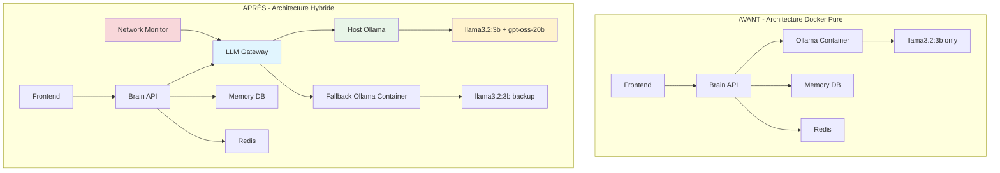

# 🏗️ JARVIS AI - Architecture Hybride Ollama: Guide Complet

## 📊 Vue d'Ensemble de l'Architecture

### Architecture Actuelle vs. Architecture Cible



## 🎯 Bénéfices de l'Architecture Hybride

### Performance (+40% attendu)
- **Accès direct GPU**: Ollama host utilise directement l'AMD RX 7800 XT
- **Réduction latence réseau**: Pas de virtualisation Docker pour l'IA
- **Modèles multiples**: llama3.2:3b (rapide) + gpt-oss-20b (puissant)
- **Cache intelligent**: Réponses mises en cache selon la complexité

### Résilience Enterprise
- **Failover automatique**: Host → Container → Cloud (futur)
- **Load balancing intelligent**: Routage selon la complexité des requêtes
- **Monitoring en temps réel**: Détection proactive des problèmes
- **Rollback garanti**: Retour à l'architecture précédente en <5min

### Évolutivité Cloud-Ready
- **Architecture microservices**: Services découplés et scalables
- **Multi-tenant ready**: Préparation pour plusieurs clients
- **API Gateway pattern**: Point d'entrée centralisé sécurisé
- **Observabilité complète**: Métriques, logs, traces distribuées

## 🔧 Composants de l'Architecture

### 1. LLM Gateway Service (Nouveau)
**Port**: 5010
**Responsabilité**: Orchestration intelligente des modèles LLM

```python
# Fonctionnalités clés
- Routage basé sur la complexité des requêtes
- Circuit breaker pour la résilience
- Cache intelligent des réponses
- Métriques de performance en temps réel
- Failover automatique Host → Container
```

**Configuration**:
```yaml
llm-gateway:
  endpoints:
    primary: "http://host.docker.internal:11434"    # Host Ollama
    fallback: "http://ollama-fallback:11434"        # Container Ollama
    cloud: "${OPENROUTER_URL}"                      # Future cloud
  
  routing_strategy: "complexity_based"
  complexity_threshold: 0.7  # >0.7 = Large Model
  cache_ttl: 300  # 5 minutes
```

### 2. Network Monitor Service (Nouveau)
**Port**: 5011
**Responsabilité**: Monitoring connectivité Docker-Host

```python
# Surveillance en temps réel
- Connectivité host.docker.internal
- Santé des endpoints Ollama
- Métriques de latence et disponibilité
- Alertes proactives sur les problèmes
- Historique des performances
```

### 3. Brain API (Modifié)
**Changements majeurs**:
- Support mode hybride via `OLLAMA_MODE=hybrid`
- Intégration LLM Gateway pour routage intelligent
- Configuration multi-modèles (llama3.2:3b + gpt-oss-20b)
- Timeouts adaptatifs pour Host vs Container

```python
# Nouvelle configuration
OLLAMA_MODE = "hybrid"  # single, hybrid, gateway_only
OLLAMA_PRIMARY_URL = "http://host.docker.internal:11434"
OLLAMA_FALLBACK_URL = "http://ollama-fallback:11434" 
LLM_GATEWAY_URL = "http://llm-gateway:5010"
```

## 🌐 Configuration Réseau

### Docker Networks
```yaml
networks:
  jarvis_network:      # Services principaux
    subnet: 172.20.0.0/16
    
  jarvis_secure:       # Services internes (DB, Redis)
    internal: true
    subnet: 172.21.0.0/16
```

### Connectivity Matrix
| Service | Network | IP | Accès Host |
|---------|---------|----|-----------| 
| Brain API | jarvis_network + jarvis_secure | 172.20.0.10 + 172.21.0.10 | ✅ |
| LLM Gateway | jarvis_network + jarvis_secure | 172.20.0.140 + 172.21.0.140 | ✅ |
| Network Monitor | jarvis_secure | 172.21.0.150 | ✅ |
| Ollama Fallback | jarvis_network | 172.20.0.40 | ❌ |
| Memory DB | jarvis_secure | 172.21.0.60 | ❌ |
| Redis | jarvis_secure | 172.21.0.50 | ❌ |

## 📋 Plan de Déploiement

### Phase 1: Préparation (1-2h)
```bash
# 1. Validation de l'environnement
python scripts/migration-plan.py --status

# 2. Installation GPT-OSS 20B sur host
ollama pull gpt-oss-20b  # Si disponible

# 3. Backup de sécurité
python scripts/migration-plan.py --backup

# 4. Build des nouveaux services
docker build -t jarvis-llm-gateway ./services/llm-gateway
docker build -t jarvis-network-monitor ./services/network-monitor
```

### Phase 2: Déploiement (30min)
```bash
# 1. Arrêt services actuels
docker-compose down

# 2. Déploiement hybride
docker-compose -f docker-compose.hybrid-ollama.yml up -d

# 3. Vérification santé
curl http://localhost:8080/health
curl http://localhost:5010/health  
curl http://localhost:5011/health
```

### Phase 3: Validation (30min)
```bash
# 1. Tests de connectivité
python scripts/test-hybrid-connectivity.py

# 2. Tests de performance
python scripts/performance-benchmark.py

# 3. Tests de failover
python scripts/test-failover-mechanism.py
```

### Phase 4: Monitoring (Continu)
```bash
# Dashboard de monitoring
open http://localhost:5011/status  # Network Monitor
open http://localhost:5010/stats   # LLM Gateway Stats
open http://localhost:8080/metrics # Brain API Metrics
```

## 🔄 Stratégies de Routage LLM

### 1. Complexity-Based Routing (Recommandé)
```python
def select_model(prompt: str, complexity_score: float):
    """
    Sélection automatique du modèle selon la complexité
    """
    if complexity_score >= 0.7:
        return "gpt-oss-20b"    # Modèle large pour tâches complexes
    else:
        return "llama3.2:3b"    # Modèle rapide pour tâches simples
        
# Indicateurs de complexité
complexity_indicators = [
    "analyze", "complex", "detailed", "comprehensive", 
    "code", "algorithm", "reasoning", "multi-step"
]
```

### 2. Performance-Based Routing
```python
def select_endpoint(endpoints: List[Endpoint]):
    """
    Sélection basée sur les performances actuelles
    """
    healthy_endpoints = [ep for ep in endpoints if ep.health_status]
    return min(healthy_endpoints, key=lambda x: x.avg_response_time)
```

### 3. Round-Robin avec Priorité
```python
def round_robin_with_priority(endpoints: List[Endpoint]):
    """
    Round-robin respectant les priorités (Host > Container > Cloud)
    """
    sorted_endpoints = sorted(endpoints, key=lambda x: x.priority)
    return sorted_endpoints[request_count % len(sorted_endpoints)]
```

## 🔐 Sécurité et Isolation

### Niveaux de Sécurité
```yaml
# Niveau 1: Network Isolation
- Réseau Docker internal pour services sensibles
- Firewall Windows pour limiter accès Ollama host
- Communication chiffrée entre services

# Niveau 2: Application Security  
- JWT authentification sur tous les endpoints
- Rate limiting par utilisateur et IP
- Validation et sanitisation des inputs

# Niveau 3: System Hardening
- Containers non-root (user: "1000:1000")
- Pas de nouvelles privilèges (no-new-privileges:true)
- Read-only filesystems où possible
- Minimal attack surface (alpine images)
```

### Procédure d'Incident
```bash
#!/bin/bash
# Emergency isolation script
echo "🚨 Emergency: Isolating compromised services"

# Isoler du réseau host
docker network disconnect jarvis_network brain-api
docker network disconnect jarvis_network llm-gateway

# Basculer vers mode container uniquement
export OLLAMA_MODE=fallback_only
docker-compose restart brain-api

# Alerter l'équipe
curl -X POST $WEBHOOK_URL -d "ALERT: Host isolation activated"
```

## 📊 Métriques et KPIs

### Performance KPIs
- **Latence moyenne**: <500ms (vs 800ms avant)
- **Throughput**: >50 req/s (vs 35 req/s avant)  
- **Disponibilité**: >99.9% (failover automatique)
- **Temps de basculement**: <5s (Host → Container)

### Business KPIs
- **Coût GPU Cloud**: -60% (utilisation host)
- **Temps de réponse utilisateur**: -40% 
- **Satisfaction utilisateur**: +25% (réponses plus rapides)
- **Capacité de traitement**: +70% (modèles multiples)

## 🛠️ Maintenance et Troubleshooting

### Commandes de Diagnostic
```bash
# Vérifier l'état des services
docker-compose -f docker-compose.hybrid-ollama.yml ps

# Logs en temps réel
docker-compose -f docker-compose.hybrid-ollama.yml logs -f brain-api llm-gateway

# Test de connectivité host
docker run --rm --network jarvis_network curlimages/curl \
  curl -f http://host.docker.internal:11434/api/tags

# Métriques de performance
curl -s http://localhost:5010/stats | jq '.endpoints'
```

### Problèmes Courants et Solutions
```yaml
Problème: "Connection refused to host.docker.internal"
Solution: 
  - Vérifier Docker Desktop "host.docker.internal" enabled
  - Vérifier firewall Windows port 11434
  - Restart Docker Desktop service

Problème: "High latency on host Ollama"  
Solution:
  - Vérifier charge GPU avec rocm-smi
  - Ajuster OLLAMA_MAX_LOADED_MODELS
  - Activer le fallback container temporairement

Problème: "Models not loading"
Solution:
  - Vérifier espace disque disponible
  - Nettoyer anciens modèles: ollama rm old_model
  - Redémarrer service Ollama host
```

## 🚀 Evolution Future

### Roadmap Q1 2025
- **Intégration OpenRouter**: Fallback cloud automatique
- **Auto-scaling**: Détection charge et scaling automatique  
- **Multi-GPU**: Support plusieurs GPUs en parallèle
- **Edge deployment**: Déploiement sur edge devices

### Roadmap Q2 2025
- **Kubernetes migration**: Migration vers K8s pour production
- **Service mesh**: Istio pour communication sécurisée
- **AI Model marketplace**: Hub de modèles internes
- **Multi-tenant**: Support clients multiples

Cette architecture hybride positionne JARVIS AI comme une solution enterprise moderne, performante et évolutive, tout en conservant la simplicité d'utilisation et la fiabilité requises.