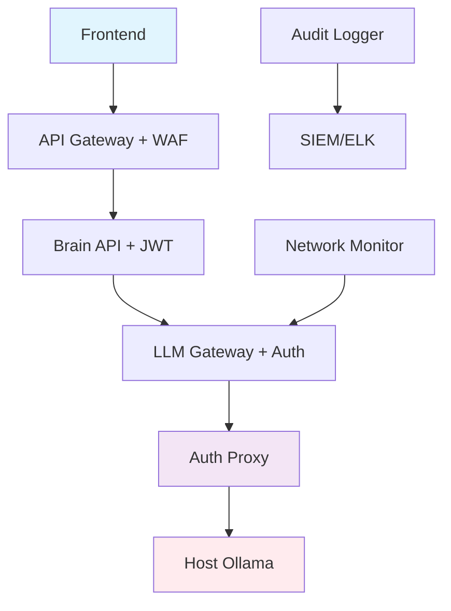

# 🔐 JARVIS Hybrid Ollama - Analyse de Sécurité

## Résumé Exécutif

La migration vers Ollama Host présente des risques de sécurité spécifiques liés à l'exposition des services host et à l'élargissement de la surface d'attaque. Cette analyse identifie les risques critiques et propose des stratégies de mitigation.

## 🚨 Risques Identifiés

### CRITIQUES (Impact Élevé)

#### 1. Exposition Host Ollama (Risque: 9/10)
**Description**: Ollama sur le host Windows expose le port 11434 directement
**Impact**: 
- Accès non autorisé aux modèles LLM
- Exécution de code malveillant via les modèles
- Vol de données sensibles traitées par l'IA

**Mitigation**:
```yaml
# Configuration firewall Windows
netsh advfirewall firewall add rule name="Ollama Local Only" dir=in action=allow protocol=TCP localport=11434 remoteip=127.0.0.1,172.20.0.0/16
```

#### 2. Communication Docker-to-Host (Risque: 8/10)  
**Description**: `host.docker.internal` permet aux containers d'accéder au host
**Impact**:
- Escalation de privilèges depuis les containers
- Accès non contrôlé aux services host
- Contournement de l'isolation Docker

**Mitigation**:
```yaml
# Dans docker-compose.hybrid-ollama.yml
services:
  brain-api:
    extra_hosts:
      - "host.docker.internal:host-gateway"
    # Limiter les capabilities
    cap_drop:
      - ALL
    cap_add:
      - NET_BIND_SERVICE
    security_opt:
      - no-new-privileges:true
      - apparmor:unconfined  # Si AppArmor disponible
```

#### 3. Absence d'Authentification LLM (Risque: 8/10)
**Description**: Ollama host n'a pas d'authentification native
**Impact**:
- Utilisation non autorisée des ressources LLM
- Injection de prompts malveillants
- Déni de service via surcharge

**Mitigation - Proxy d'Authentification**:
```python
# services/llm-proxy/auth_proxy.py
class OllamaAuthProxy:
    def __init__(self):
        self.jwt_secret = os.getenv("JWT_SECRET_KEY")
        self.rate_limiter = RateLimiter(max_requests=100, window=3600)
    
    async def authenticate_request(self, request):
        token = request.headers.get("Authorization", "").replace("Bearer ", "")
        try:
            payload = jwt.decode(token, self.jwt_secret, algorithms=["HS256"])
            return payload["user_id"]
        except:
            raise HTTPException(401, "Invalid token")
    
    async def proxy_request(self, request, user_id):
        # Rate limiting par utilisateur
        if not self.rate_limiter.allow(user_id):
            raise HTTPException(429, "Rate limit exceeded")
        
        # Log de sécurité
        logger.info("LLM request", user=user_id, prompt_hash=hash(request.prompt))
        
        # Proxy vers Ollama host avec validation
        return await self.forward_to_ollama(request)
```

### ÉLEVÉS (Impact Modéré)

#### 4. Injection de Modèles Malveillants (Risque: 7/10)
**Description**: Possibilité d'installer des modèles compromis sur Ollama host
**Impact**:
- Exfiltration de données via les réponses
- Backdoors dans les modèles
- Réponses biaisées ou malveillantes

**Mitigation**:
```python
# services/model-validator/validator.py
class ModelValidator:
    TRUSTED_SOURCES = [
        "https://ollama.ai/library/",
        "https://huggingface.co/",
    ]
    
    async def validate_model(self, model_name: str) -> bool:
        # Vérification de la source
        model_info = await self.get_model_info(model_name)
        if model_info.get("source") not in self.TRUSTED_SOURCES:
            logger.warning("Untrusted model source", model=model_name)
            return False
        
        # Vérification de checksums
        expected_hash = model_info.get("sha256")
        actual_hash = await self.calculate_model_hash(model_name)
        
        return expected_hash == actual_hash
```

#### 5. Logs et Audit Trail Incomplets (Risque: 6/10)
**Description**: Manque de traçabilité des requêtes cross-host
**Impact**: 
- Détection d'intrusion compromise
- Compliance non respectée
- Investigation post-incident difficile

**Mitigation - Audit Centralisé**:
```python
# services/audit-logger/main.py
class AuditLogger:
    def __init__(self):
        self.elasticsearch_client = Elasticsearch(os.getenv("ES_URL"))
    
    async def log_llm_request(self, event_data):
        audit_entry = {
            "timestamp": datetime.now().isoformat(),
            "event_type": "llm_request",
            "user_id": event_data.get("user_id"),
            "source_ip": event_data.get("source_ip"),
            "model_used": event_data.get("model"),
            "endpoint": event_data.get("endpoint"),
            "prompt_hash": hashlib.sha256(event_data["prompt"].encode()).hexdigest(),
            "response_size": len(event_data.get("response", "")),
            "processing_time": event_data.get("processing_time"),
            "success": event_data.get("success", False)
        }
        
        await self.elasticsearch_client.index(
            index=f"jarvis-audit-{datetime.now().strftime('%Y.%m')}",
            document=audit_entry
        )
```

## 🛡️ Architecture de Sécurité Renforcée

### 1. Defense in Depth



### 2. Réseau Segmenté avec Zones de Confiance

```yaml
networks:
  # Zone publique (Frontend)
  jarvis_public:
    driver: bridge
    ipam:
      config:
        - subnet: 172.18.0.0/16
  
  # Zone DMZ (API Gateway, LLM Gateway)  
  jarvis_dmz:
    driver: bridge
    ipam:
      config:
        - subnet: 172.19.0.0/16
  
  # Zone privée (Brain API, DB, Redis)
  jarvis_private:
    driver: bridge
    internal: true
    ipam:
      config:
        - subnet: 172.20.0.0/16
  
  # Zone management (Monitoring, Logs)
  jarvis_management:
    driver: bridge
    internal: true
    ipam:
      config:
        - subnet: 172.21.0.0/16
```

### 3. Configuration Sécurisée des Services

#### A. Brain API Hardening
```yaml
brain-api:
  security_opt:
    - no-new-privileges:true
    - seccomp:unconfined  # À ajuster selon les besoins
  cap_drop:
    - ALL
  cap_add:
    - NET_BIND_SERVICE
  read_only: true
  tmpfs:
    - /tmp
    - /var/cache
  environment:
    - SECURITY_HEADERS_ENABLED=true
    - REQUEST_RATE_LIMIT=100
    - CORS_STRICT_MODE=true
```

#### B. LLM Gateway Sécurisé
```python
# services/llm-gateway/security.py
class SecurityMiddleware:
    async def __call__(self, request: Request, call_next):
        # Validation input
        if not self.validate_input(request):
            raise HTTPException(400, "Invalid input")
        
        # Rate limiting
        if not await self.check_rate_limit(request.client.host):
            raise HTTPException(429, "Rate limit exceeded")
        
        # Content filtering
        if self.contains_malicious_content(await request.body()):
            logger.warning("Malicious content detected", ip=request.client.host)
            raise HTTPException(400, "Content rejected")
        
        response = await call_next(request)
        
        # Response filtering
        return self.sanitize_response(response)
```

## 🔍 Monitoring et Detection

### 1. Métriques de Sécurité en Temps Réel

```python
# services/security-monitor/metrics.py
SECURITY_METRICS = [
    "failed_auth_attempts_total",
    "suspicious_prompts_total", 
    "model_load_attempts_total",
    "host_access_violations_total",
    "rate_limit_exceeded_total",
    "cross_network_requests_total"
]

class SecurityMonitor:
    def __init__(self):
        self.prometheus_client = PrometheusClient()
        self.alert_thresholds = {
            "failed_auth_rate": 10,      # 10 échecs/minute
            "suspicious_prompts": 5,     # 5 prompts suspects/heure
            "host_violations": 1         # 1 violation = alerte immédiate
        }
    
    async def check_security_thresholds(self):
        metrics = await self.prometheus_client.get_current_metrics()
        
        for metric, threshold in self.alert_thresholds.items():
            if metrics.get(metric, 0) > threshold:
                await self.trigger_security_alert(metric, metrics[metric])
```

### 2. Détection d'Anomalies

```python
# services/anomaly-detector/detector.py
class LLMAnomalyDetector:
    def __init__(self):
        self.baseline_patterns = self.load_baseline()
        self.ml_model = joblib.load("models/anomaly_detection.pkl")
    
    async def analyze_request(self, request_data):
        features = self.extract_features(request_data)
        anomaly_score = self.ml_model.predict([features])[0]
        
        if anomaly_score > 0.7:  # Seuil d'anomalie
            await self.flag_suspicious_activity(request_data, anomaly_score)
        
        return anomaly_score < 0.5  # Autoriser si score normal
```

## 📋 Plan d'Implémentation Sécurisé

### Phase 1: Renforcement Infrastructure (Semaine 1)
- [ ] Configuration firewall Windows pour Ollama
- [ ] Mise en place proxy d'authentification 
- [ ] Segmentation réseau Docker
- [ ] Audit logging centralisé

### Phase 2: Monitoring Sécuritaire (Semaine 2)  
- [ ] Déploiement security monitor
- [ ] Configuration alertes temps réel
- [ ] Tests de pénétration internes
- [ ] Formation équipe sécurité

### Phase 3: Validation et Certification (Semaine 3)
- [ ] Audit de sécurité externe
- [ ] Tests de charge avec scenarios malveillants
- [ ] Documentation procédures incident response
- [ ] Certification conformité (RGPD, etc.)

## 🚨 Procédures d'Incident Response

### 1. Détection d'Intrusion
```bash
# Script d'intervention d'urgence
#!/bin/bash
# emergency_response.sh

echo "🚨 JARVIS Security Incident Response"

# Isoler les services compromis
docker network disconnect jarvis_network suspicious_container

# Sauvegarder les logs
docker logs brain-api > /security/logs/brain-api-incident-$(date +%Y%m%d_%H%M%S).log

# Basculer vers mode sécurisé
export OLLAMA_MODE=fallback_only
docker-compose -f docker-compose.secure-mode.yml up -d

# Alerter l'équipe
curl -X POST webhook_url -d "ALERT: JARVIS security incident detected"
```

### 2. Matrice d'Escalation
| Niveau | Délai | Actions | Responsable |
|--------|-------|---------|-------------|
| 1 - Info | 1h | Log, Monitor | DevOps |
| 2 - Warning | 30min | Investigation, Containment | Security Team |
| 3 - Critical | 15min | Isolation, Emergency Response | CISO |
| 4 - Emergency | 5min | System Shutdown, Crisis Team | CEO/CTO |

## 📊 KPIs de Sécurité

### Métriques Critiques
- **MTTR (Mean Time To Response)**: < 15 minutes
- **MTTD (Mean Time To Detection)**: < 5 minutes  
- **False Positive Rate**: < 2%
- **Security Coverage**: > 95%

### Tableau de Bord Sécurité
```json
{
  "security_dashboard": {
    "current_threat_level": "GREEN",
    "active_sessions": 45,
    "failed_auth_24h": 12,
    "model_integrity_checks": "PASSED",
    "network_anomalies": 0,
    "last_security_scan": "2025-08-06T10:30:00Z"
  }
}
```

Cette analyse de sécurité forme un framework complet pour sécuriser la migration Ollama host tout en maintenant les performances et la fonctionnalité attendues.