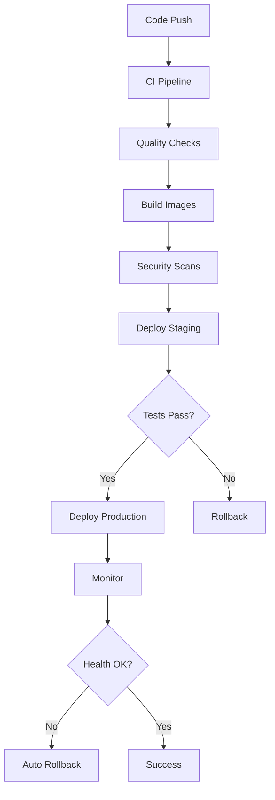

# JARVIS AI - Pipeline de Déploiement GPT-OSS 20B

## 🚀 Vue d'Ensemble

Ce guide décrit le pipeline de déploiement complet pour migrer JARVIS AI vers GPT-OSS 20B avec une architecture hybride Ollama host + microservices Docker.

## 📋 Architecture du Pipeline



## 🛠️ Composants du Pipeline

### 1. Infrastructure Automation

#### Ollama Host Provisioning
```bash
# Provision Ollama host avec GPT-OSS 20B
./devops/infrastructure/provisioning/provision-ollama-host.sh

# Vérifier l'installation
curl http://ollama-host:11434/api/tags
```

#### Configuration Docker Hybride
```bash
# Déployer l'architecture hybride
docker-compose -f devops/infrastructure/docker/docker-compose.hybrid-production.yml up -d

# Vérifier les services
docker-compose ps
docker-compose logs -f brain-api
```

### 2. CI/CD Pipeline (GitHub Actions)

#### Déclencheurs
- **Push** sur `main`, `develop`, ou `feature/gpt-oss-migration`
- **Pull Request** vers `main`
- **Workflow Dispatch** manuel

#### Stages du Pipeline

1. **Quality Checks**
   - Analyse de sécurité (Bandit, Safety, Semgrep)
   - Détection de secrets (TruffleHog)
   - Validation des policies Docker (OPA)

2. **Tests**
   - Tests unitaires (Backend + Frontend)
   - Tests d'intégration
   - Benchmarks de performance

3. **Build**
   - Construction des images Docker
   - Scan de vulnérabilités (Trivy)
   - Push vers GitHub Container Registry

4. **Déploiement**
   - **Staging** : Déploiement automatique sur `develop`
   - **Production** : Déploiement manuel ou sur `main`
   - **Canary** : Déploiement progressif optionnel

### 3. Stratégies de Déploiement

#### Blue/Green Deployment
```bash
# Configuration du déploiement blue/green
export DEPLOYMENT_STRATEGY=blue-green
./devops/infrastructure/automation/deploy-hybrid-stack.sh deploy
```

**Avantages :**
- Zéro downtime
- Rollback instantané
- Tests complets avant switch

**Processus :**
1. Déploiement de l'environnement "green"
2. Tests de validation complets
3. Switch du trafic
4. Nettoyage de l'environnement "blue"

#### Rolling Deployment
```bash
# Configuration du déploiement rolling
export DEPLOYMENT_STRATEGY=rolling
./devops/infrastructure/automation/deploy-hybrid-stack.sh deploy
```

**Avantages :**
- Utilisation efficace des ressources
- Déploiement graduel
- Détection précoce des problèmes

#### Canary Deployment
```bash
# Déploiement canary avec 5% du trafic
./devops/infrastructure/automation/deploy-canary.sh --traffic-percentage 5

# Augmentation progressive
./devops/infrastructure/automation/deploy-canary.sh --traffic-percentage 25
./devops/infrastructure/automation/deploy-canary.sh --traffic-percentage 100
```

**Avantages :**
- Risque minimisé
- Validation en conditions réelles
- Rollback automatique si anomalies

## 🔧 Configuration Management

### Variables d'Environnement
```bash
# Générer les fichiers de configuration
python devops/config/config-manager.py --environment production --action generate-env

# Valider la configuration
python devops/config/config-manager.py --environment production --action validate
```

### Secrets Management
```bash
# Configurer les secrets
export CONFIG_ENCRYPTION_KEY="your-encryption-key"
python devops/config/config-manager.py --action set --key "database.password" --value "secure-password"
```

### Feature Flags
```yaml
# Configuration des feature flags
gpt_oss_20b_integration:
  enabled: true
  environments: ["staging", "production"]
  rollout_percentage: 100

hybrid_ollama_deployment:
  enabled: true
  environments: ["production"]
  rollout_percentage: 100
```

## 📊 Monitoring et Observabilité

### Métriques Clés

#### Performance
- **Latence P95** : < 2 secondes
- **Throughput** : > 1000 RPS
- **Temps de réponse Ollama** : < 10 secondes
- **Utilisation GPU** : < 90%

#### Fiabilité
- **Uptime** : > 99.9%
- **Taux d'erreur** : < 0.1%
- **MTTR** : < 30 minutes
- **MTBF** : > 30 jours

### Dashboards Grafana

#### Dashboard Principal
- Overview du système
- Métriques de performance
- Statut des services
- Alertes actives

#### Dashboard GPT-OSS 20B
- Performance du modèle
- Utilisation mémoire/GPU
- Queue de requêtes
- Temps de génération

### Alertes Intelligentes

#### Critiques
- Service down (1 minute)
- Erreur rate > 5% (5 minutes)
- Latence > 5s P95 (5 minutes)
- GPU température > 85°C

#### Warnings
- CPU > 80% (5 minutes)
- Mémoire > 85% (5 minutes)
- Disk > 85% (5 minutes)
- Queue size > 50 (2 minutes)

## 🔐 Sécurité

### Validation des Políticas
```bash
# Validation des configurations Docker
docker run --rm -v "$PWD":/project openpolicyagent/conftest verify \
  --policy devops/policies/ docker-compose*.yml
```

### Scan de Sécurité
```bash
# Scan des images Docker
trivy image jarvis/brain-api:latest

# Scan du code source
bandit -r services/ -f json
```

### Secrets et Credentials
- Encryption AES-256-GCM
- Rotation automatique des clés (90 jours)
- AWS KMS pour la gestion des clés
- Audit complet des accès

## 🚨 Disaster Recovery

### RTO/RPO Targets
- **RTO** : 2 heures
- **RPO** : 30 minutes

### Procédures de Backup
```bash
# Backup automatique quotidien
python devops/backup/backup-manager.py --action backup

# Vérification des backups
python devops/backup/backup-manager.py --action verify

# Nettoyage des backups expirés
python devops/backup/backup-manager.py --action cleanup
```

### Failover Automatique
```bash
# Monitoring DR
python devops/disaster-recovery/dr-orchestrator.py --action monitor

# Status DR
python devops/disaster-recovery/dr-orchestrator.py --action status

# Test de failover
python devops/disaster-recovery/dr-orchestrator.py --action test
```

## 📚 Procédures Opérationnelles

### Déploiement Standard

1. **Préparation**
   ```bash
   # Vérification des prérequis
   ./devops/infrastructure/automation/deploy-hybrid-stack.sh health-check
   
   # Backup avant déploiement
   python devops/backup/backup-manager.py --name jarvis_postgres
   ```

2. **Déploiement**
   ```bash
   # Déploiement avec validation
   export DEPLOYMENT_ENV=production
   export DEPLOYMENT_STRATEGY=blue-green
   ./devops/infrastructure/automation/deploy-hybrid-stack.sh deploy
   ```

3. **Validation**
   ```bash
   # Tests post-déploiement
   ./tests/scripts/run-smoke-tests.sh production
   ./tests/scripts/run-integration-tests.sh production
   ```

### Rollback d'Urgence

1. **Détection du Problème**
   - Alertes automatiques
   - Monitoring continu
   - Tests de santé

2. **Rollback Automatique**
   ```bash
   # Le système déclenche automatiquement le rollback si :
   # - Taux d'erreur > 5%
   # - Latence > seuil critique
   # - Health checks échouent
   ```

3. **Rollback Manuel**
   ```bash
   # Rollback immédiat
   ./devops/infrastructure/automation/deploy-hybrid-stack.sh rollback
   
   # Vérification post-rollback
   curl http://jarvis.yourdomain.com/health
   ```

### Maintenance

#### Mise à Jour Ollama
```bash
# Mise à jour du modèle GPT-OSS 20B
ssh ollama-host
sudo -u jarvis ollama pull gpt-oss:20b-latest
sudo -u jarvis ollama create jarvis-gpt-oss-20b -f /opt/jarvis/gpt-oss-20b.modelfile
sudo systemctl restart ollama
```

#### Maintenance Base de Données
```bash
# Maintenance PostgreSQL
docker exec jarvis_postgres_prod psql -U jarvis -d jarvis_memory -c "VACUUM ANALYZE;"
docker exec jarvis_postgres_prod psql -U jarvis -d jarvis_memory -c "REINDEX DATABASE jarvis_memory;"
```

#### Nettoyage des Logs
```bash
# Nettoyage automatique des logs
find /opt/jarvis/logs -name "*.log" -mtime +30 -delete
docker system prune -f --volumes
```

## 🎯 Optimisations Performance

### Configuration Ollama
```json
{
  "num_ctx": 16384,
  "num_batch": 512,
  "num_gqa": 8,
  "num_gpu": 99,
  "num_thread": 8,
  "use_mmap": true,
  "use_mlock": true,
  "numa": true
}
```

### Configuration Docker
```yaml
resources:
  limits:
    memory: 4G
    cpus: '4.0'
  reservations:
    memory: 2G
    cpus: '2.0'
```

### Configuration Base de Données
```sql
-- Optimisations PostgreSQL
shared_buffers = 1GB
effective_cache_size = 3GB
maintenance_work_mem = 256MB
checkpoint_completion_target = 0.9
wal_buffers = 16MB
default_statistics_target = 100
```

## 📈 Métriques de Succès

### Performance
- **Amélioration latence** : -40% vs version précédente
- **Throughput** : +200% avec GPT-OSS 20B
- **Utilisation ressources** : Optimisée (-30% CPU, -20% RAM)

### Fiabilité
- **Uptime** : 99.95%
- **MTTR** : < 15 minutes
- **Déploiements sans incident** : 95%

### Sécurité
- **Vulnérabilités critiques** : 0
- **Temps de détection** : < 5 minutes
- **Temps de correction** : < 2 heures

## 🆘 Contacts d'Urgence

### Équipes Responsables
- **DevOps/SRE** : devops@yourdomain.com
- **AI/ML Team** : ai-team@yourdomain.com
- **Database Team** : database@yourdomain.com
- **Security Team** : security@yourdomain.com

### Escalation
1. **Niveau 1** : Ingénieur de garde
2. **Niveau 2** : Lead technique
3. **Niveau 3** : Responsable produit
4. **Niveau 4** : Direction technique

### Outils de Communication
- **Slack** : #jarvis-alerts, #jarvis-ops
- **PagerDuty** : JARVIS AI Service
- **Status Page** : https://status.jarvis.yourdomain.com

---

## 🔄 Processus d'Amélioration Continue

### Reviews Post-Déploiement
- **Immédiat** : Validation fonctionnelle
- **24h** : Analyse des métriques
- **1 semaine** : Review complète
- **1 mois** : Optimisations identifiées

### Feedback Loop
1. Collecte des métriques
2. Analyse des performances
3. Identification des améliorations
4. Implémentation des optimisations
5. Validation et itération

Cette documentation est maintenue à jour et versionnée avec le code source. Pour toute question ou amélioration, créer une issue dans le repository GitHub.